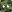

#   Quotouflage

A guessing game where you need to figure out which of your friends wrote a quote, all while disguising your quotes as theirs!


## Methods for Playing

There are two ways that you can play the game with others:  
1. Websockets (✨ Recommended)
2. [Trystero](https://github.com/dmotz/trystero)

Websockets are a fast and reliable method to play with others, but requires a server and some technical knowledge to setup.

Trystero is a peer-to-peer networking setup which connects players via WebRTC and different managed strategies. When using trystero, details on how to connect to your computer may be spread and shared via third party services and relays. These details are usually limited to [SDP description packets](https://en.wikipedia.org/wiki/Session_Description_Protocol), which may (but usually don't) include your public IP address, private IP address, computer hostname, email address, and more (depending on your web browser's implementation).

## Setting Up Websockets

Setting up websockets requires [building from source](#building-from-source) for now, so follow the directions in that section first to get setup.

Open the file named ".env" in your favorite text editor. Lines with a \# in front of them will have no effect on the gameplay.

To enable websockets, your file should look similar to this:
```md
# Gameplay Variables
PUBLIC_PIN_LENGTH=6

# Network Adapter
PUBLIC_ADAPTER=websocket
```

After you've built the project, start the websocket server by installing [tsm](https://github.com/lukeed/tsm) with `pnpm install -g tsm` (or npm, bun, etc.) and running `tsm server.ts` in the project root to start the server on port 3000.

## Setting Up Trystero

Setting up trystero does not require building from source. Either follow the below instructions with [building from source](#building-from-source), or download the trystero build from the [Releases](https://github.com/ugackMiner53/quotouflage/releases) and upload it to your favorite

To enable trystero, your file should look similar to this:
```md
# Gameplay Variables
PUBLIC_PIN_LENGTH=6

# Network Adapter
PUBLIC_ADAPTER=trystero
```


## Building from Source

Requirements:
- [NodeJS](https://nodejs.org/en) (Developed with `v22.4.0`)
- NPM complient package manager ([pnpm](https://pnpm.io/), [npm](https://docs.npmjs.com/cli/v7/configuring-npm/install), [bun](https://bun.sh/))
- [Git CLI](https://git-scm.com/)

If not otherwise described, all commands below will be run in your system's version of Command Prompt / Terminal.

First, download the code by running `git clone https://github.com/ugackMiner53/quotouflage.git`, which should create a folder named "quotouflage".

You can then enter the folder with `cd quotouflage`, and install all needed components by running `pnpm install` (or `npm install`, `bun install`, whatever package manager you have).

If you have a domain that Quotouflage will be running on, replace "YOUR-URL-HERE" in `src/app.html` with the domain that you'll be using (this will allow correct image previews with OpenGraph).

Finally, if you're following one of the "Setting Up" sections, make sure you have the `.env` file setup correctly before running `pnpm build` (or `npm build`, `bun build`, etc.) to build the project into the `build` directory.